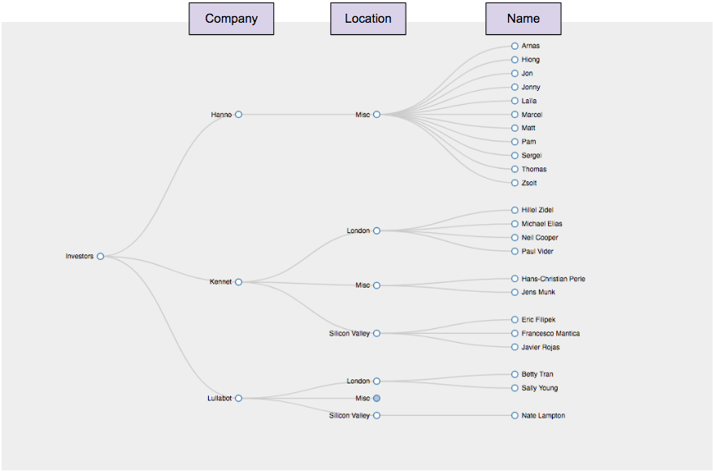
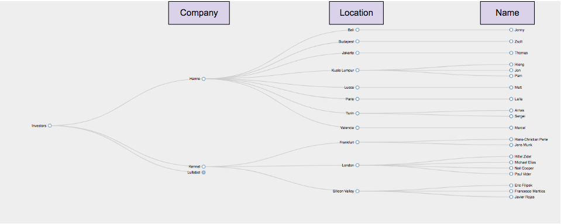

Author: Patrick Stetz  [(github)](https://github.com/pstetz/)

## Project goal:

Using Python scrape the names and titles of members on different websites.

## Introduction:

This repo includes a simple solution for one website and a more extensive approach for multiple websites.  I prefer Jupyter notebooks over pure python files so I decided to keep the notebooks I used in case someone had a similar preference.

# 1.) simple.py

Run `python simple.py` or `py simple.py` in the root directory of this folder

# 2.) tree.py

Run `python tree.py` or `py tree.py` in the root directory of this folder

This code goes a bit further and scrapes 3 company websites for their team members and locations.  It stores their information into a file that is parsed by a D3 visualization tree written by Rob Schmuecker ([**available here**](http://bl.ocks.org/robschmuecker/7880033)).  The visualization tree is nicely written (again not by me) and one can zoom, pan, collapse branches, and rearrange branches.  

tree.py can be customizated in two ways:

By setting misc_is_a_category to True, the code behaves like simple.py; it groups team members by location into user specified categories like London and Silicon Valley and places the remainder of the team members into a Misc category.

By setting this variable to false, the code records all the locations and removes the Misc category from the tree.

